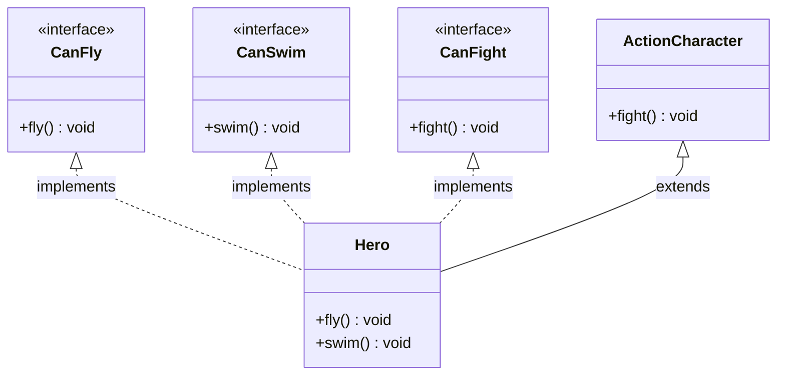
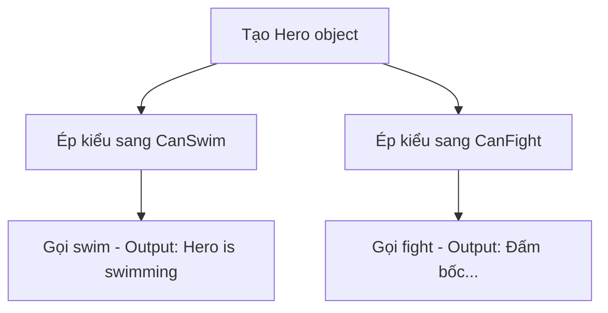

# Bài 2: Super Hero - Đa kế thừa Interface

## Tóm tắt ý tưởng chính

Bài này minh họa cách Java giải quyết **vấn đề đa kế thừa** thông qua **Interface**. Khi một lớp cần nhiều hành vi khác nhau (bay, bơi, chiến đấu), Java dùng interface thay vì cho phép kế thừa nhiều lớp.

## Lời giải

### Kiến trúc chương trình

### Luồng thực thi

## Trả lời câu hỏi

> **Lớp Hero có cần implement lại fight() của interface CanFight không?**

**Không cần.** Vì `ActionCharacter` đã có phương thức `fight()` với cùng chữ ký, Java tự động coi `ActionCharacter.fight()` là implementation của `CanFight.fight()`. Đây là cách Java xử lý **diamond problem** - lớp con kế thừa implementation từ lớp cha để thỏa mãn interface.

## Lý do chọn hướng tiếp cận này

| Cách tiếp cận | Ưu điểm | Nhược điểm |
|---------------|---------|------------|
| **Interface (chọn)** | Cho phép đa kế thừa hành vi, linh hoạt | Phải implement lại nếu không có lớp cha |
| Abstract class | Code reuse tốt | Chỉ kế thừa được 1 lớp |
| Kép interface + class cha | Tận dụng cả 2: code reuse + đa kế thừa | Phức tạp hơn |

**Lựa chọn:** Kép interface + class cha vì Hero vừa cần hành vi chiến đấu từ `ActionCharacter`, vừa cần khả năng bay, bơi riêng biệt.