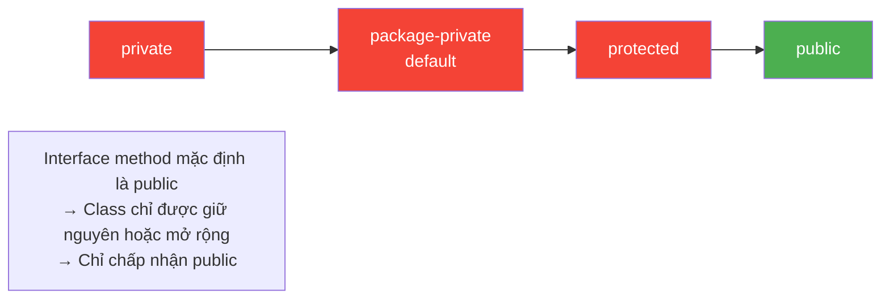

# Bài 4: The Access Modifier Trap

## Tóm tắt

Khi một class `implements` interface, các method override **không thể có quyền truy cập thấp hơn** so với method trong interface. Trong interface, method mặc định là `public abstract`. Nếu class ghi method mà thiếu `public` (mặc định thành package-private), Java sẽ báo lỗi biên dịch.

## Trả lời câu hỏi

**Lỗi gì xuất hiện khi biên dịch?**

```
error: show() in DataManager cannot implement show() in IData
    void show() {
         ^
  attempting to assign weaker access privileges; was public
1 error
```
**Giải thích:**

- Trong `interface IData`, method `void show()` mặc định là **`public abstract`**
- Trong `DataManager`, method `void show()` không có modifier nên mặc định là **package-private** (default access)
- Quy tắc Java: khi override/implements method, quyền truy cập chỉ được **giữ nguyên hoặc mở rộng**, không được **thu hẹp**
- `package-private` < `public` → vi phạm quy tắc → lỗi biên dịch
- **Cách sửa:** Thêm `public` vào method `show()` trong class `DataManager`

## Quy tắc Access Modifier trong Interface/Class

| Modifier trong Interface | Modifier tối thiểu trong Class | Kết quả |
|---|---|---|
| `public` | `public` | Hợp lệ |
| `public` | package-private | **Lỗi** |
| `public` | `protected` | **Lỗi** |
| `public` | `private` | **Lỗi** |

### Mức độ Access Modifier


