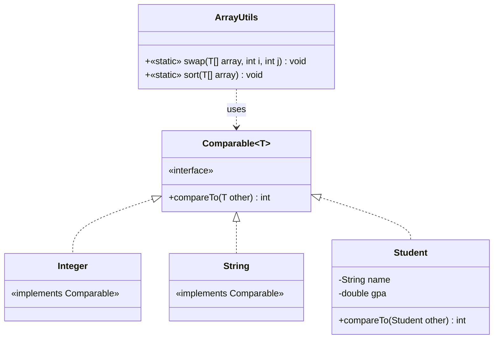

# Bài 6: The Universal Sorter

## Tóm tắt ý tưởng chính

Sử dụng **Generic** (`<T>`) trong Java để viết thuật toán Bubble Sort **một lần**, chạy được cho **mọi kiểu dữ liệu** có
khả năng so sánh (`Comparable`).

- `<T>` — cho phép phương thức hoạt động với bất kỳ kiểu đối tượng nào.
---
**Tại sao khai báo <T extends Comparable<T>> lại quan trọng**
- Để dùng được `compareTo`, Java bắt buộc các phần tử trong mảng T phải biết cách tự so sánh.
- `<T extends Comparable<T>>` — ràng buộc `T` phải implements `Comparable`, đảm bảo gọi được `compareTo()`.
  ```java
  public static <T extends Comparable<T>> void sort(T[] array)
  ```
- Nếu bạn truyền vào một mảng chứa đối tượng tự tạo mà chưa định nghĩa luật so sánh (**chưa implements `Comparable`**), code sẽ báo lỗi ngay lập tức.
- Ví dụ: 
  ```java
    public class Student implements Comparable<Student> { // logic }
    ```
--- 

- `A.compareTo(B)` sẽ đem đối tượng `A` so sánh với đối tượng `B` và luôn trả về một số nguyên (`int`) thuộc 1 trong 3
  trường hợp sau:

    1. `< 0`: Có nghĩa là `A nhỏ hơn B` (Nên xếp A đứng trước B).
    2. `== 0`: Có nghĩa là `A bằng B`.
    3. `> 0`: Có nghĩa là `A lớn hơn B` (Nên xếp A đứng sau B).

→ Tạo ra các kiểu sắp xếp mặc định (Natural Ordering). Ví dụ: Số thì tăng dần, chữ thì theo alphabet.

---
- `compare(A, B)`: rả về một số nguyên (`int`):
  1. `< 0`: Có nghĩa là `A nhỏ hơn B` (Nên xếp A đứng trước B).
  2. `== 0`: Có nghĩa là `A bằng B`.
  3. `> 0`: Có nghĩa là `A lớn hơn B` (Nên xếp A đứng sau B).

→ Tạo ra các kiểu sắp xếp tùy chỉnh

```java
@Override
public int compareTo(Student other) {
  return Double.compare(this.gpa, other.gpa);
}
```
`Integer.compare(this.age, other.age)`
`Double.compare(this.gpa, other.gpa)`
`Boolean.compare(this.isPass, other.isPass)`: false < true
`this.name.compareTo(other.name)`: String thì ko cần thêm String. Sắp xếp theo bảng chữ cái A-Z. Có phân biệt chữ hoa, chữ thường (Chữ hoa đứng trước chữ thường).
`this.name.compareToIgnoreCase(other.name)`: String nhưng ignore case


### TĂNG DẦN VÀ GIẢM DẦN
- Tăng dần (Bé -> Lớn): Double.compare(this.gpa, other.gpa);
- Giảm dần (Lớn -> Bé): Double.compare(other.gpa, this.gpa); (Lưu ý: chữ other được đưa lên trước)

### Sắp xếp đa điều kiện
```java
@Override
public int compareTo(Student other) {
    // 1. So sánh điểm trước (Giảm dần nên để other lên trước)
    int ketQuaSoSanhDiem = Double.compare(other.gpa, this.gpa);
    
    // 2. Nếu điểm KHÁC NHAU (!= 0), trả về kết quả điểm luôn
    if (ketQuaSoSanhDiem != 0) {
        return ketQuaSoSanhDiem;
    }
    
    // 3. Nếu điểm BẰNG NHAU (== 0), đi xuống đây và so sánh tiếp bằng Tên (Tăng dần)
    return this.name.compareToIgnoreCase(other.name);
}
```

---

```java
@Override
    public int compare(SinhVien sv1, SinhVien sv2) {
        // Sử dụng compareTo của String để so sánh 2 cái tên
        return sv1.getTen().compareTo(sv2.getTen());
    }
```

## Lý do chọn Generic + Bubble Sort

| Tiêu chí         | Cách tiếp cận này                                  | Cách khác (viết riêng cho từng kiểu) |
|------------------|----------------------------------------------------|--------------------------------------|
| Tái sử dụng code | Viết 1 lần, dùng cho Integer, String, Student, ... | Viết lại cho mỗi kiểu                |
| An toàn kiểu     | Compile-time kiểm tra                              | Dễ lỗi khi copy-paste                |
| Dễ mở rộng       | Thêm kiểu mới chỉ cần `implements Comparable`      | Phải viết thêm hàm sort              |

**Ưu điểm chính:**

- **DRY** (Don't Repeat Yourself): Logic sort chỉ viết 1 lần.
- **Type safety**: Lỗi so sánh bị bắt ở compile-time, không phải runtime.
- **Open for extension**: Muốn sort `Employee`, `Product`, ... chỉ cần implements `Comparable`.

## Cấu trúc chương trình


