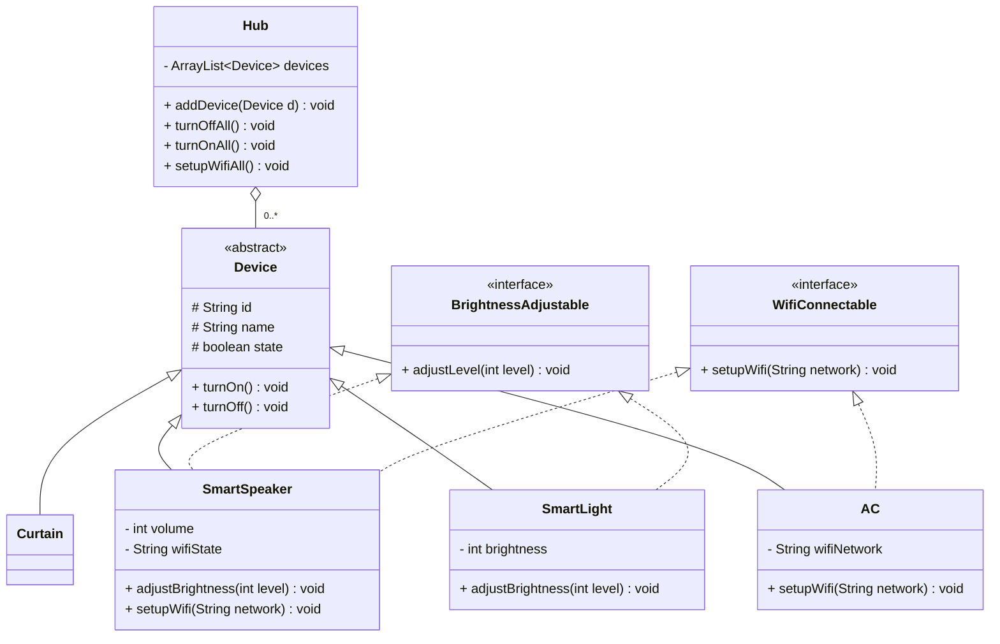

# Bài 8: Hệ thống nhà thông minh

## 1. Tóm tắt ý tưởng chính của lời giải

Bài toán yêu cầu quản lý nhiều loại thiết bị có **hành vi chung** (bật/tắt) nhưng **khả năng riêng** (điều chỉnh mức độ, kết nối Wifi).

Để thiết kế hệ thống linh hoạt và dễ mở rộng, chương trình sử dụng:

- **Abstract Class** để định nghĩa cấu trúc chung của thiết bị
- **Interface** để mô tả các khả năng riêng biệt
- **Polymorphism** và **instanceof** để xử lý danh sách thiết bị hỗn hợp

---

## 2. Trả lời câu hỏi: Khi nào dùng Abstract Class, khi nào dùng Interface?

| Dùng **Abstract Class** khi... | Dùng **Interface** khi... |
|---|---|
| Các subclass **chia sẻ dữ liệu chung** (id, name, status) | Cần mô tả **khả năng** mà nhiều class không liên quan đều có |
| Cần **code reuse** — logic bật/tắt giống nhau cho mọi thiết bị | Cần **đa kế thừa hành vi** — SmartSpeaker vừa Dimmable vừa WifiConnectable |
| Có **quan hệ "is-a"** rõ ràng | Có **quan hệ "can-do"** |

> **Quy tắc**: Abstract class = "Tôi **là** cái gì đó" (is-a). Interface = "Tôi **có thể làm** cái gì đó" (can-do).

---

## 3. Sơ đồ lớp hệ thống

---

## 4. Ý nghĩa bài học

### Abstract Class

Dùng khi tất cả subclass **chia sẻ dữ liệu và hành vi chung**. Mọi thiết bị đều có id, name, status, turnOn/turnOff → đặt vào abstract class `Device`.

### Interface

Dùng khi cần mô tả **khả năng riêng biệt** mà chỉ một số class có. Wifi không phải thiết bị nào cũng có → `WifiConnectable`. Điều chỉnh mức độ cũng vậy → `Dimmable`.

### Polymorphism

Hub quản lý `List<Device>` chứa hỗn hợp SmartLight, AC, SmartSpeaker, Curtain — xử lý thống nhất mà không cần biết chi tiết từng loại.

### instanceof + Downcasting

Khi cần xử lý theo khả năng riêng (chỉ WifiConnectable mới setup wifi), dùng `instanceof` kiểm tra rồi downcasting để gọi phương thức interface.